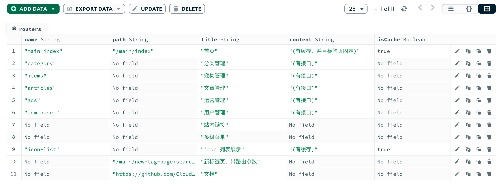
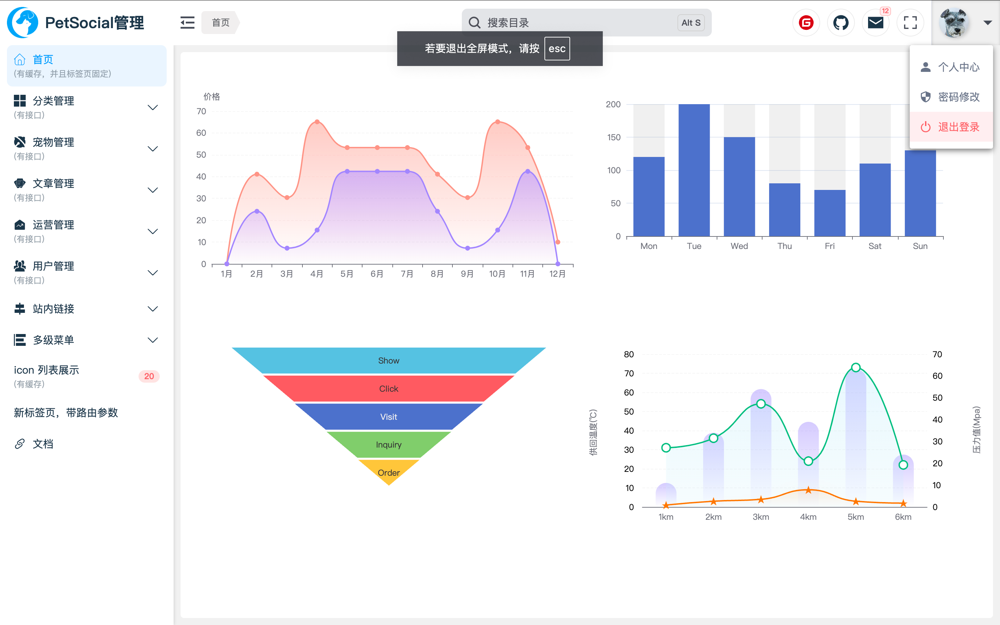
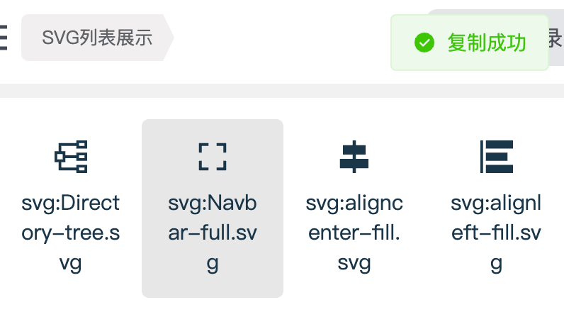

# Pet-Social-Web


## 前言

菜单中标识”有接口“的部分是为了《Pet-Social》项目而做的数据管理，以下是开源和演示地址：

《Pet-social-H5》H5端项目开源地址：https://github.com/CloudDong0125/Pet-social-H5

《Pet-Social-Server》服务端开源地址：https://github.com/CloudDong0125/Pet-social-Server


为了对管理端更多的操作，我将会加入些新的功能（如数据图标、站内链接、多级菜单的使用）以及封装组件。（正在更新中......）


## 动态路由

采用Node.js+Mongodb 接口形式来管理路由表

> 


## 基本布局搭建

> 


## 常用的工具函数

- copy功能：https://www.npmjs.com/package/copy-to-clipboard

  ```js
  // src/common/otherTools.js
  
  import copy from 'copy-to-clipboard';
  
  /**
   * copy value
   * 数据粘贴板复制
   */
  export function copyValue(value) {
      copy(value);
  }
  ```

  ```js
  <!-- src/views/system/iconList/svgList.vue -->
  import { copyValue } from "@/common/OtherTools";
  
  <!-- copy事件 -->
  function onClick(item) {
    let msg = `<SvgIcon:style="'width:23px;height:23px;'"name="${item.name}"></SvgIcon>`;
  	copyValue(msg);
  	ElMessage({
  	message: "复制成功",
  	type: "success",
  	});
  }    
  ```

  > 

  

