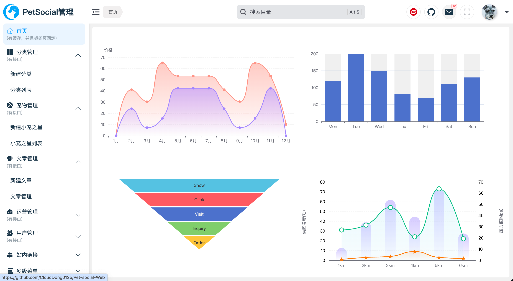

# Pet-Social-Web

## 前言：

菜单中标识**“有接口”**的部分是《Pet-Social》而做的数据管理，以下是开源和演示地址：

《Pet-social-H5》H5端项目开源地址：https://github.com/CloudDong0125/Pet-social-H5

《Pet-Social-Server》服务端开源地址：https://github.com/CloudDong0125/Pet-social-Server

为了对管理端更多的操作，我将会加入些新的功能（如数据图标、站内链接、多级菜单的使用）以及封装组件。（正在更新中......）

## 基本布局搭建

> 

